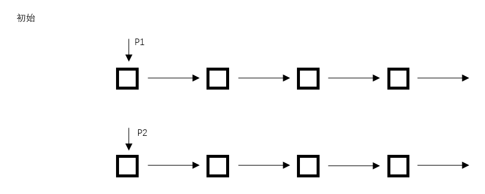

# Offer_015

## 题目描述
输入两个单调递增的链表，输出两个链表合成后的链表，当然我们需要合成后的链表满足单调不减规则。

节点数据结构：
```
struct ListNode {
	int val;
	struct ListNode *next;
	ListNode(int x) :
			val(x), next(NULL) {
	}
```

## 基本思想


## 其他
其实这里的算法还可以再进行优化，因为每次移动之后只需要进行上图中“比较下一级”这个操作就可以了，因为在主链上的当前节点，已经是和另外一个相比的比较小的节点了。
